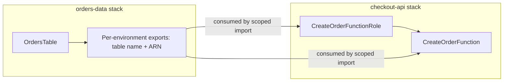

# ShopFluent Orders — Architecture Context

## Stacks
- **orders-data** (`templates/orders-table.yml`): owns the `OrdersTable` DynamoDB table and publishes metadata for downstream stacks.
- **checkout-api** (`templates/checkout-api.yml`): runs `CreateOrderFunction` behind `POST /api/orders` and reads the table name/ARN published by the data stack.

## Environments
The platform runs the same two stacks per environment. Each environment is deployed with its own parameter file under `parameters/`.

Supported environments are intentionally limited to:
- `dev`
- `staging`
- `prod`

Both templates enforce this with the `Environment` parameter `AllowedValues` list so ad-hoc environment names fail CloudFormation validation before resources are created.

## Dependency direction



## Cross-stack export names
The original global export names caused account/region-wide collisions:
- `OrdersTableName`
- `OrdersTableArn`

The data stack now publishes scoped export names:
- `shopfluent-orders-${Environment}-OrdersTableName`
- `shopfluent-orders-${Environment}-OrdersTableArn`

The checkout API imports the matching scoped export names using the same `Environment` parameter. For example, `checkout-api-staging` imports:
- `shopfluent-orders-staging-OrdersTableName`
- `shopfluent-orders-staging-OrdersTableArn`

That sets `CreateOrderFunction.Environment.Variables.ORDERS_TABLE` to the staging table name, `shopfluent-orders-staging`, and grants the role access to the staging table ARN.

## Production data safety
The production DynamoDB table already contains live order data. The template intentionally keeps the table physical name stable:

```yaml
TableName: !Sub 'shopfluent-orders-${Environment}'
```

For prod, this remains `shopfluent-orders-prod`. The template also keeps:
- `DeletionPolicy: Retain`
- `UpdateReplacePolicy: Retain`

Before executing any production data-stack change set, verify that `OrdersTable` has no replacement and no deletion action. A safe export-only migration should not change the table physical resource ID, key schema, or table name.

## Safe production migration order
Because CloudFormation exports cannot be removed or renamed while another stack imports them, migrate production in phases:

1. Update `orders-data-prod` with `PublishLegacyExports=true` to add the new scoped exports while keeping the old global exports.
2. Update `checkout-api-prod` so it imports `shopfluent-orders-prod-OrdersTableName` and `shopfluent-orders-prod-OrdersTableArn`.
3. Verify the old exports have no importers with `list-imports`.
4. Update `orders-data-prod` again with `PublishLegacyExports=false` to remove the unused legacy exports.

For new or non-prod environments, keep `PublishLegacyExports=false` and deploy data before API.

## Notes for reviewers
- The data stack publishes metadata that the API stack consumes; the two are deployed as separate stacks per environment.
- Export names must be unique in an account/region, so all steady-state exports include the environment.
- Because production data is live, template edits must be evaluated for replacement risk before execution.
- Exported values participate in stack update/delete constraints once another stack imports them.
